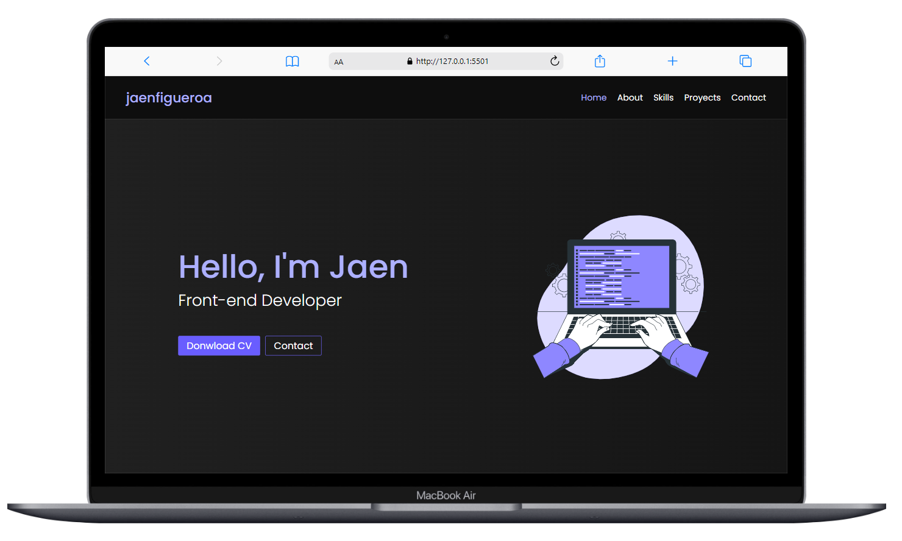
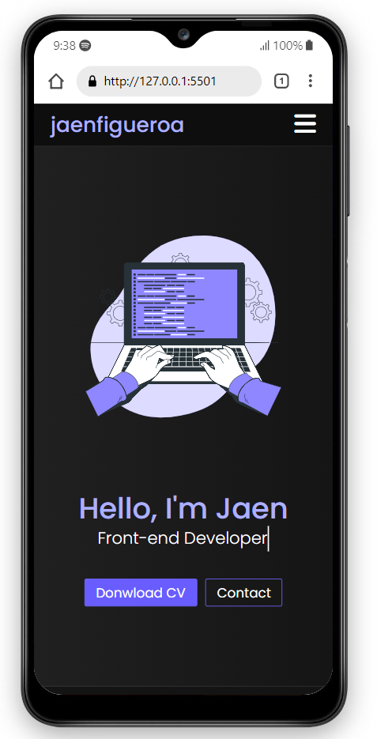

# portafolio 🚀😀

## 💡 Brief

In this project, I have developed a portafolio.

- ### Desktop preview

- ### Mobile preview

## 🔠 Fonts

- Poppins - https://fonts.google.com/specimen/Poppins?query=poppins

## 🎨 Colors

- border color: #d7d6fc
- Pattens Blue: #e1f0fe
- Ghost White: #f7f7ff
- White Ice: #defef0
- background color: #EFF0F6
- primary purple: #6B00F5

## 🌍 Website

You can try my final result [here](https://jaenfigueroa.github.io/portafolio).

